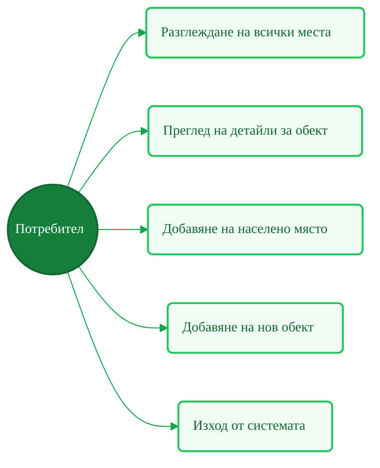
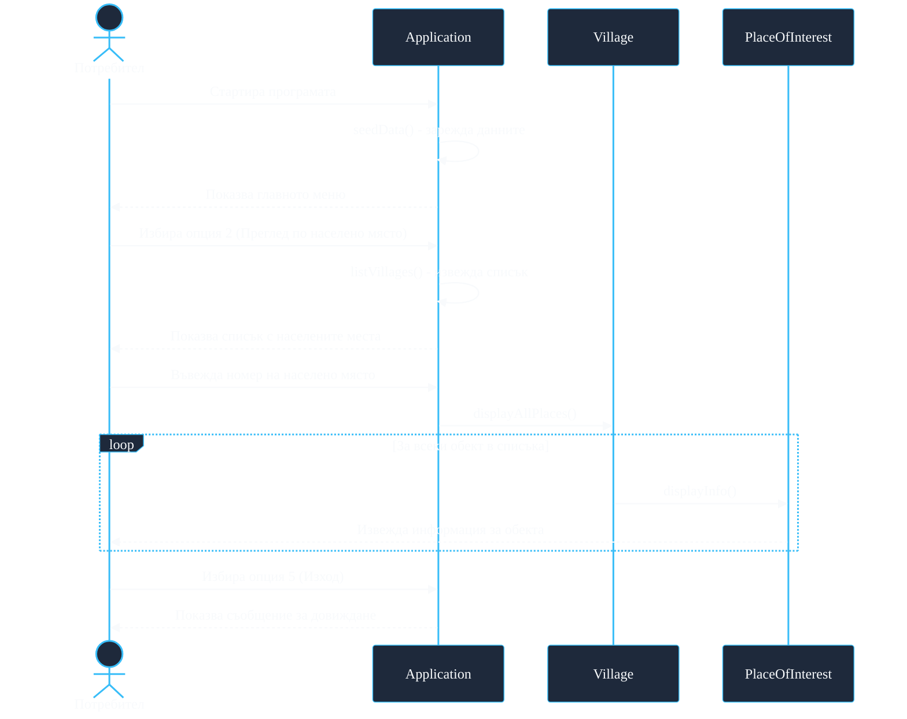
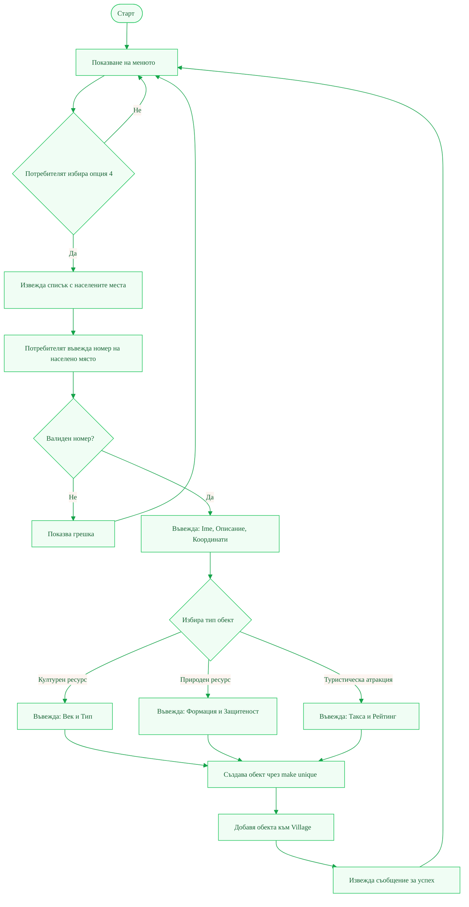

# Анализ на проблема #

## 1. Проблем ##

В България съществуват стотици малки населени места — исторически села, планински колиби и крайбрежни селища — с изключително богато културно, историческо и природно наследство. Въпреки огромния си потенциал, голяма част от тях остават практически невидими за широката публика и за туристическата индустрия.

Причините за това са многобройни:

- **Липса на централизирана информация:** Данните за забележителностите са разпръснати из различни сайтове, социални мрежи и местни брошури, без единна и структурирана платформа.
- **Слаба дигитална видимост:** Повечето малки общини нямат ресурси да поддържат актуален уебсайт или дигитално присъствие.
- **Трудност при планиране:** Туристите трудно намират информация, достатъчна за организиране на пълноценен маршрут или посещение.
- **Икономически последствия:** Местните бизнеси (хотели, занаятчии, ресторанти) губят потенциални клиенти, а общините — приходи от туризъм.
- **Заплаха за културното наследство:** Непопуляризираните обекти са изложени на занемаряване и разрушение поради липса на интерес и финансиране.

---

## 2. Целева група ##

Приложението е насочено към три основни групи потребители:

|--------------------|------------------------------|----------------------------------------|
|        Група       |            Нужди             |        Как приложението помага         |
|--------------------|------------------------------|----------------------------------------|
|    **Туристи**     | Да намират интересни места,  | Структуриран достъп до забележителности|
|                    | описания, координати.        | по категории и населено място.         |
|--------------------|------------------------------|----------------------------------------|
|  **Общини и НПО**  | Да популяризират своите      | Лесно добавяне и управление на нови    |
|                    | ресурси и наследство.        | обекти в системата.                    |
|--------------------|------------------------------|----------------------------------------|
| **Местни бизнеси** | Да привличат повече          | Видимост чрез включване в туристически |
|                    | посетители.                  | атракции с рейтинг и цена.             |
|--------------------|------------------------------|----------------------------------------|

---

## 3. Решение ##

Разработване на конзолно приложение **„Скритите Съкровища на България"**, изградено върху принципите на Обектно-ориентираното програмиране (ООП) в C++.

Приложението предоставя:
- **Структурирана база от данни** за малки села и техните забележителности (културни, природни, туристически).
- **Интерактивно меню** за разглеждане, търсене и добавяне на нова информация в реално време.
- **Разширяема архитектура** — новите типове обекти могат лесно да се добавят чрез наследяване от абстрактния базов клас `PlaceOfInterest`.

---

## 4. Ползи ##

- **За туристите:** По-лесно и бързо намиране на непознати, но красиви дестинации в България.
- **За общините:** Дигитализиране и популяризиране на местното наследство без сложни технически умения.
- **За местния бизнес:** По-голяма видимост и достигане до нова аудитория от туристи.
- **За държавата и културата:** Активно съхранение на историческото и природното наследство чрез повишен интерес и финансиране.

---

## 5. Диаграма на случаите на употреба (Use Case Diagram) ##

Диаграмата показва основните действия, които потребителите (туристи и администратори) могат да извършват в системата.

> **Обяснение:** Потребителят (актьор) взаимодейства с пет основни функционалности на системата. Разделянето между разглеждане и добавяне показва, че системата поддържа два режима — четене и запис.

---

## 6. Диаграма на последователността (Sequence Diagram) ##

Диаграмата описва стъпките при сценария „Потребителят избира населено място и разглежда неговите забележителности".

> **Обяснение:** Диаграмата илюстрира комуникацията между обектите в реално време. Ключов момент е `loop` блокът, където `Village` итерира по своя вектор и чрез **полиморфизъм** извиква конкретния `displayInfo()` на всеки наследник на `PlaceOfInterest`.

---

## 7. Диаграма на дейностите (Activity Diagram) ##

Диаграмата показва логиката при добавянето на нов обект от потребителя — сценарий „Добавяне на нов обект".

> **Обяснение:** Диаграмата на дейностите проследява целия поток при добавяне на обект — от входа на потребителя, през валидацията, до разклонението по тип обект и финалното му добавяне в структурата. Разклонението `Избира тип обект` отразява директно полиморфизма в кода: в зависимост от избора се създава `CulturalResource`, `NaturalResource` или `TouristAttraction`.
